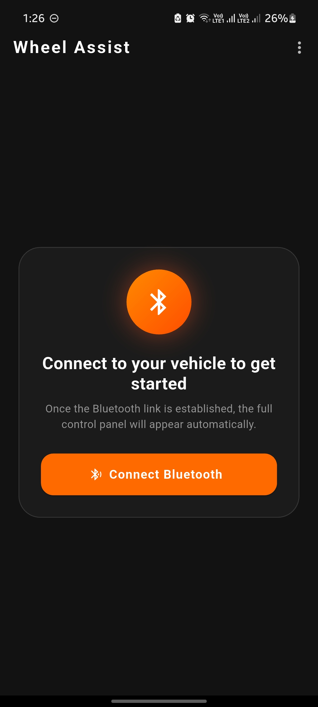

# Wheel Assist

Wheel Assist is a Flutter mobile app for controlling a BLE-enabled wheelchair/vehicle with manual controls, voice commands, live camera stream, and on-device auto-stop detection.

## Features

- Bluetooth scan/connect/disconnect flow with user feedback toasts.
- Connection landing state that shows a single Bluetooth connect action until connected.
- BLE command channel for movement control and feedback channel for live state data.
- Direction control pad (forward, backward, left, right, stop).
- Mode toggle between GYRO mode and APP mode.
- Speed control slider with live command updates in APP mode.
- Tuning controls:
	- Turn arc slider.
	- Drift left slider.
	- Drift right slider.
- Voice mode using speech recognition:
	- Movement commands (forward/backward/left/right/stop).
	- Speed commands (faster/slower).
- Status bar with:
	- Connection state.
	- Current command.
	- Gyro X/Y feedback.
- Camera screen with MJPEG stream from camera IP.
- Auto-stop system:
	- TFLite model inference in isolate.
	- Bounding-box rendering.
	- Stop-zone trigger when detected object is large and centered.
	- Sends stop command and resumes after delay.
- About screen with team member cards and social link launch support.

## Tech Stack

- Flutter
- Dart
- Provider (state management)
- flutter_blue_plus (BLE)
- speech_to_text (voice commands)
- permission_handler (microphone/speech permission integration)
- http (camera stream fetch)
- image (image decode/resize)
- tflite_flutter (TensorFlow Lite inference)
- toastification (in-app status messages)
- url_launcher (open social links from About screen)

## BLE Protocol

- Device name: CarController
- Commands:
	- 0: Stop
	- 1: Forward
	- 2: Backward
	- 3: Left
	- 4: Right
- Modes:
	- 0: Gyro
	- 1: App

## Setup

1. Install Flutter SDK and platform toolchains for your target (Android/iOS/Linux/Web/Windows/macOS).
2. From project root, get dependencies:
	 flutter pub get
3. Run the app:
	 flutter run

## Runtime Notes

- Camera stream URL format used by app: http://<camera-ip>:81/stream
- Auto-stop detection runs every 30 frames in the current implementation.
- Voice mode restarts listening automatically when speech session ends.

<!-- ## Demo

 -->

## Visuals

